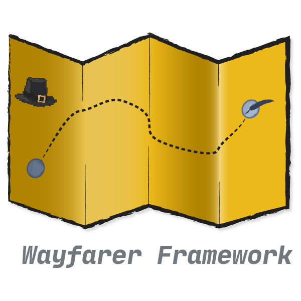

# Wayfarer Framework v1.0.0



A small Godot 4 framework for 2D games.

From Prototypes to Game Jams and Full Releases use this framework to get up and running quickly!

- Highly customizable
- Use only what you need
- Want to support the project and get a license (and remove the attribution logo) it's only $5

Includes mobile support, localization, settings management, dev tools, and UI systems out of the box.

[](https://godotengine.org/)
[](LICENSE)


---

## Features

### Scene & UI System
- Splash screen → main menu → options → gameplay → credits
- Pause menu with resume & quit support
- Reusable transitions with fade in/out effects
- Modular scene loading and management via `SceneLoader`

### Input & Controls
- Keyboard, mouse, and controller support (InputMap-ready)
- Touch controls with D-Pad + A/B buttons (mobile only or toggleable)
- Actions include: `ui_left`, `ui_right`, `jump`, `attack`, and more

### Settings System
- Auto-saves to `user://settings.cfg`
- Volume slider linked to `AudioManager`
- Language preference saved across sessions
- Console-accessible reset command

### Localization & Translator UI
- Multi-language support using `.tres` files
- English, Spanish, German, French, Portugeuse, Chinese and Japanese included, extensible to more
- Built-in translation editor plugin for content creators
- `tr()` integration across UI scenes for live updates

### Dev Console (Toggle with `~`)
- Commands: `help`, `set_volume`, `reset_settings`, `touch_controls`
- Interactive feedback display
- Disabled by default — enable with `--dev` argument at launch

### Mobile-Ready
- Auto-hides touch controls on desktop
- Responsive scaling for various screen sizes
- Dev/test support via `touch_controls` command or `FORCE_TOUCH_ON_DESKTOP`

### Command-Line Flags
`--dev`: Enables the dev console and test tools

`--skip-splash`: Skips the splash screen and loads the main menu instantly

Combine flags in Project Settings > Run > Main Run Args (space-separated)

### Pause & Options Integration
In-game pause menu (Esc or ui_cancel)

OptionsMenu works as both:

- A standalone scene (from Main Menu)
- A popup (from Pause Menu) maintains paused state
- Smart back-navigation: returns to previous context

### Modal Overlay
Options shown as a dimmed overlay when accessed from pause
Background UI is deactivated and visually separated

## Touch Controls

Supports on-screen touch controls for mobile devices, and includes a flexible runtime toggle for testing on desktop.

### Enable Touch Controls

- On real touch devices (Android/iOS), controls appear automatically.
- In the editor or desktop builds, use the `--touch` command-line flag or the dev console.

### Dev Console Commands

You can enable or disable touch controls during play using:

```
touch_controls on # shows touch UI
touch_controls off # hides touch UI
touch_controls status # prints current state
```
These settings are saved to `user://settings.cfg`.

> Project Settings Note
>
> If "Emulate Touch From Mouse" is enabled in Project Settings, Godot may incorrectly report touch availability on desktop.
> Wayfarer safely overrides this with its own logic.


---

## Getting Started

To run in dev mode:

```bash
godot4 --path . --dev
```
To skip the splash screen when developing, set Main Run Args to: `--skip-splash`

To enable the dev console in-editor:

1. Go to Project > Project Settings
2. Open the Run tab
3. Set Main Run Args to: `--dev`

To reset settings (clears `user://settings.cfg`):

Open the dev console (~) and type:

```
reset_settings
```

## Folder Structure

```
/ui                → Menus, HUDs, pause screens
/ui/touch_controls → Mobile D-Pad + buttons
/core              → SceneLoader, AudioManager, Transition logic
/autoload          → SettingsManager, LocalizationManager
/translations      → .tres files per language
/addons            → In-editor translation tool
/debug             → extend your dev console here!
/assets            → fonts, music, sounds, and images
/scenes            → Your game scenes go here
```

### Want to remove the Wayfarer Framework splash screen?

This framework is free to use under the MIT license, but includes a required splash screen as minimal attribution.

If you’d like to remove that splash for a commercial project, reach out for a no-attribution license:
info@pixelpilgrimstudios.com

One-time license pricing starts at $5.

| License Type   | For Who?                                | Price   |
|----------------|-----------------------------------------|---------|
| Free (MIT)     | Anyone using with splash attribution    | $0      |
| Indie License  | Solo dev or hobbyist, no attribution    | $5      |
| Studio License | Teams with funding, unlimited use       | $35     |
| Custom License | Companies who want white-label, support | Contact |

---

## Included Assets & Licenses

This project includes a small number of third-party assets used for prototyping and demonstration purposes. Each is included under its original license:

### Kenney 1-Bit UI Atlas

- Source: [kenney.nl/assets/1-bit-ui](https://kenney.nl/assets/1-bit-ui)
- License: [Creative Commons Zero (CC0)](/assets/kenney/LICESNSE)
- Included in: `res://assets/kenney/`

### Fonts

- **PressStart2P** – by [Codeman38](https://www.zone38.net/font/), under [SIL Open Font License](/assets/fonts/LICENSE), in `res://assets/fonts/`

### Sound Effects

- **pixelpilgrimstudios.mp3** – Original by Abraham Cuenca (Pixel Pilgrim Studios)
- **UI sounds** – Originals by Abraham Cuenca (Pixel Pilgrim Studios) under [MIT LICENSE](/assets/sounds/LICENSE)

### Game Music

- **bg_music** – Background music by Abraham Cuenca (Pixel Pilgrim Studios) under [MIT LICENSE](/assets/music/LICENSE)


---

## Built by Pixel Pilgrim Studios
This project is maintained with love by Abraham Cuenca.
Feel free to fork, extend, and build wild new worlds with it.

---

## Attribution Requirement

If you publish a game or commercial project using **Wayfarer Framework**, you must include:

- The default **Wayfarer Framework splash screen**
These are integrated into the framework by design and serve as minimal credit for its creation.

If you wish to remove or replace it, please reach out for a license.

---

Licensed under the [MIT License](LICENSE)

© 2025 Abraham Cuenca, Pixel Pilgrim Studios
